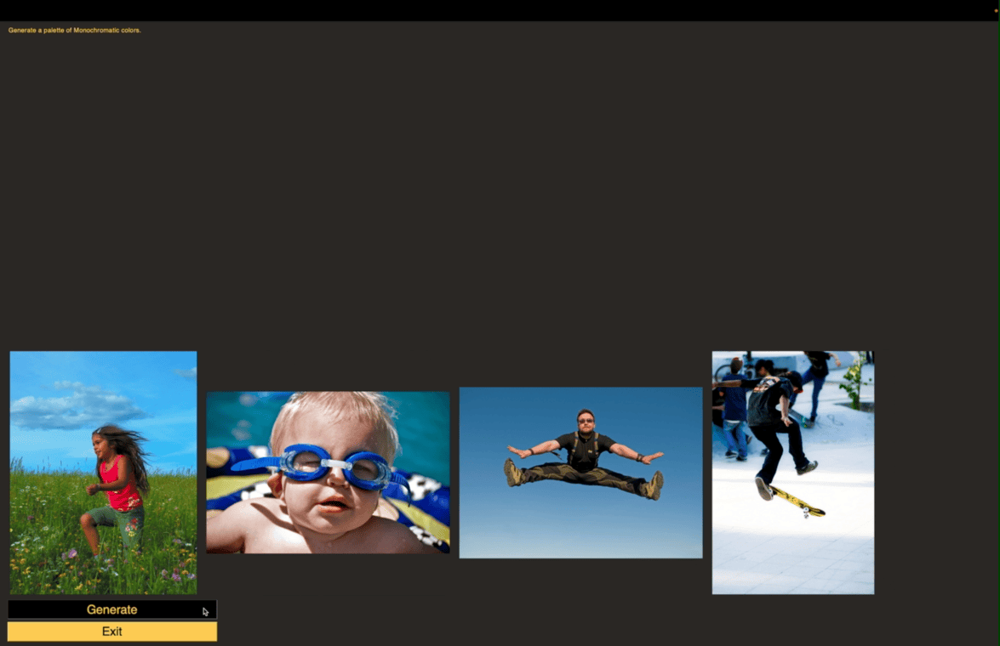

# image_palette

Image_palette creates palettes of images for creative visual inspiration. 

The only currently supported palette generation style is monochromatic, but there will be more to come!

### Demo 

https://www.youtube.com/watch?v=8Xb56A7Hxik

## Monochromatic Palette Generation

Finds the dominant color for every image, and then displays images with different HSV "values" but similar "hues" and "saturation". 

## Directions

The primary dataset, already indexed, is Flickr8k from Kaggle: https://www.kaggle.com/datasets/adityajn105/flickr8k . 

Create an archive/Images folder. Drop Flicker8k into the Images folder. 

After setting up the directory, simply run gui.py and you're off to the races!
